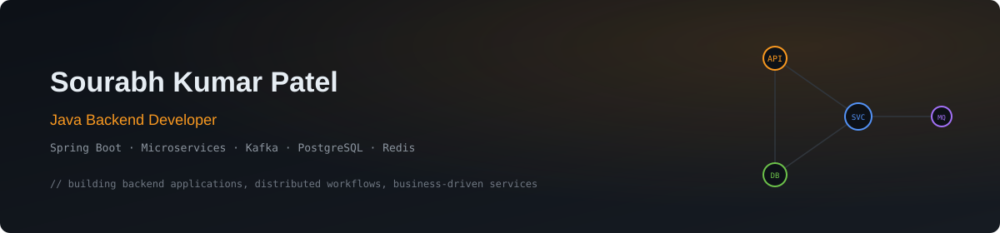
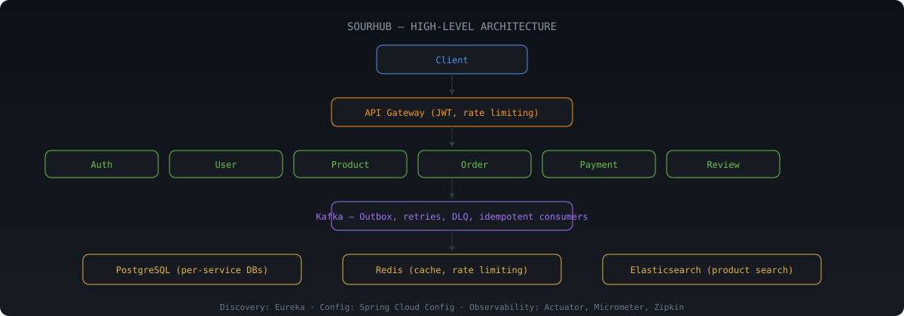

# Hi, I'm Sourabh Kumar Patel

### Java Backend Developer | Spring Boot | Microservices | Kafka

Building backend applications, distributed workflows, and business-driven services with Java and Spring Boot.

  
  
  

📍🇮🇳 India &nbsp;•&nbsp; 🎯 Java Backend Developer / Software Engineer &nbsp;•&nbsp; ⚡ Available immediately

---

## About

Java Backend Developer with **4 years of professional software development experience** across enterprise and freelance projects, working with Java, Spring Boot, Hibernate/JPA, SQL, and REST APIs.

- Experienced in building backend applications, developing business-driven solutions, and implementing backend business logic and application workflows.
- Hands-on with Microservices, Kafka, PostgreSQL, Redis, JWT, WebSocket, Docker, and automated testing.

---

## Tech Stack

  
  
  
  
  
  
  
  
  
  
  
  
  

| Area | Technologies |
|---|---|
| Languages | Java, SQL |
| Backend | Spring Boot, Spring MVC, Spring Data JPA, Hibernate, Spring Cloud, REST APIs, Microservices, WebSocket, Bean Validation, OpenAPI/Swagger |
| Core Java | OOP, Collections, Streams & Lambdas, Multithreading & Concurrency, Exception Handling |
| Messaging & Security | Apache Kafka, Event-Driven Architecture, Spring Security, JWT, RBAC |
| Databases / Data | PostgreSQL, Oracle, MySQL, Azure Cosmos DB, Redis, Elasticsearch |
| Testing | JUnit 5, Mockito, Spring Boot Test, Integration Testing |
| DevOps / Tools | Git, GitHub, Maven, Docker, Docker Compose, Jenkins |
| Practices | API Design, Transaction Management, Performance Optimization, Logging & Monitoring, Root Cause Analysis, Database Troubleshooting, Agile/Scrum |

---

## Engineering Focus

- Designing and building Spring Boot microservices with clear service boundaries
- Event-driven workflows with Kafka, outbox patterns, retries, and idempotency
- Concurrency-safe booking/order flows using transactions and locking
- Caching strategies with Redis, search with Elasticsearch
- Secure APIs with Spring Security, JWT, and role-based authorization
- Testing with JUnit 5, Mockito, and integration tests

---

## Featured Project — SourHub

  
  
  
  
  
  
  

**SourHub – Microservices E-Commerce Platform** — a 9-application microservices backend with API Gateway, authentication, user, product, order, payment, and review domains, using Eureka service discovery and centralized configuration.

- API Gateway secured with JWT validation, role- and ownership-based authorization, correlation IDs, and Redis-backed distributed rate limiting (100 requests/minute per client IP)
- Reliable Kafka order/payment workflows via transactional outbox, scheduled retries, retry topics with dead-letter handling, and idempotent consumers
- Database-per-service across 6 PostgreSQL databases, Redis caching, Elasticsearch product search
- Multi-seller orders, inventory with payment-failure compensation, payment splits, coupons, returns, shipment tracking, invoices, verified reviews, seller operations (REST/Feign)
- Observability: Spring Boot Actuator, Micrometer, Prometheus, Grafana, Zipkin; retries, timeouts, circuit breakers

🔗 Repository: [github.com/sourabh2308-dev/ecommerce-backend](https://github.com/sourabh2308-dev/ecommerce-backend)

---

## Smart Queue & Appointment Management Platform

  
  
  
  
  
  

*Ongoing project.* A role-based queue and appointment platform supporting scheduled appointments, walk-in queues, multiple service counters, and staff operations.

- Designing workflows with working-hour/holiday validation, conflict prevention, controlled state transitions, priority handling, and approximate wait-time estimation
- Implementing concurrency-safe booking and queue operations using transactions, constraints, and locking strategies
- Adding real-time updates via WebSocket/STOMP, selective Redis caching, and Spring Security with JWT + role-based authorization

---

## Professional Experience

**Software Engineer — Cognizant Technology Solutions** · Oct 2020 – Oct 2023

*Context: network monitoring, observability, and inventory applications.*

- Supported 5+ enterprise network monitoring, observability, and inventory applications, contributing to Java/Spring Boot troubleshooting, bug fixes, enhancements, and SQL/Oracle data analysis
- Resolved production incidents across Spring Boot services and database components through root cause analysis and corrective fixes
- Used Hibernate/JPA, SQL, and Oracle to analyze application queries, validate records, and fix application-to-database problems
- Automated recurring application checks, monitoring activities, reports, and database validations, saving ~1 hour of manual effort per day
- Supported production and weekend deployments with post-release validation and monitoring
- Collaborated in Agile/Scrum teams with developers and cross-functional teams

**Freelance Java Backend Developer** · Dec 2025 – Sep 2026

*Confidential client — subscription usage and overage management platform for AI products.*

- Built the complete backend using Java, Spring Boot, Microservices, and REST APIs: AI token usage tracking, monthly subscription limits, overage management
- Developed a Kafka-based ingestion pipeline consuming daily raw AI usage events, persisted in Azure Cosmos DB
- Implemented batch background processing to aggregate input/output token usage into PostgreSQL for reporting and overage calculation
- Improved data access across Cosmos DB and PostgreSQL through targeted indexing and query optimization
- Added Redis caching for customer, subscription, and license data, reducing downstream API calls from ~30 per instance per month to 1–2
- Delivered REST APIs for usage reports, subscription/overage visibility, upsell & dispute requests, and automated notification-to-invoice progression

**Career Break / Upskilling** · Oct 2023 – Nov 2025

Focused on Java backend development and strengthened skills in Spring Boot, microservices, Kafka, databases, caching, security, and observability through hands-on projects and technical learning.

---

## Current Focus

- Java backend development with Spring Boot and microservices
- Event-driven systems with Kafka
- Concurrency-safe workflows, caching, and secure API design

---

  
  
  

